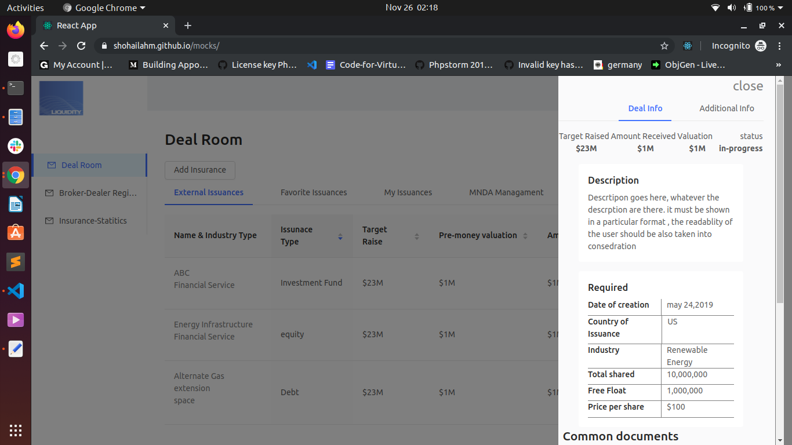
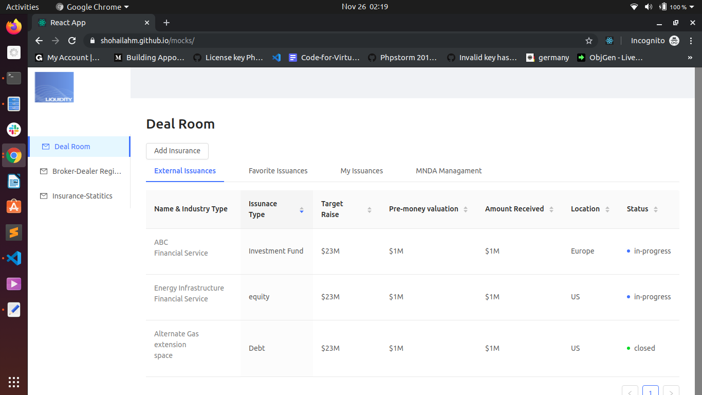

### Libraries used
antd - https://ant.design/

### open in incognito mode if some issue .
can be accessed at [http://shohailahm.github.io/mocks]

## Available Scripts
### `npm install`

### `npm start`
its been ejected and webpack configs have been changed

Runs the app in the development mode. 
Open [http://localhost:3000](http://localhost:3000) to view it in the browser.

The page will reload if you make edits. 
You will also see any lint errors in the console.